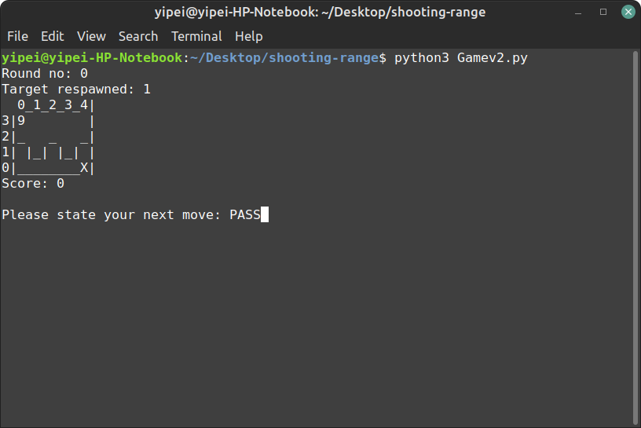
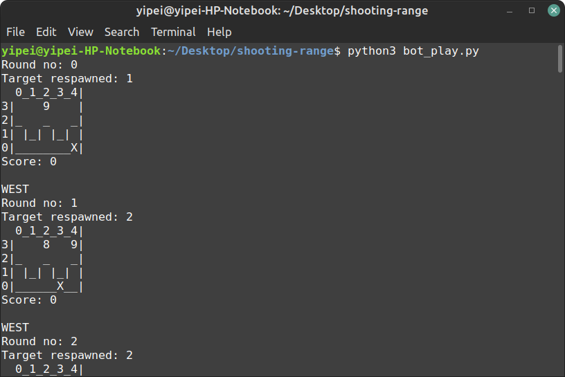

# Shooting range game
This game is designed to simulate a shooting range, while a player can move within the range and shoot targets that will expire in certain rounds.

## Usage
To play the game and insert your command:
```python
from Gamev2 import Game
game  = Game()
game.interactive()
```


<br>
Gamev2 is the only stable version yet. Gamev1 is no longer being maintained. Gamev3 is unstable and experimental. More interested mechanism will be added into Gamev3.

<br>

Valid commands are:
- SHOOT
- PASS
- NORTH
- SOUTH
- WEST
- EAST

The range is seperated by "|" and "_". As a player you are not allowed to across the border as this will invalid the game and reduce your score. To earn score, you need to move into a booth(row 1) and call the "SHOOT" command to fire. The targets are represents in integers located in row 3. The integer reprsents the number of remaining rounds. They will disappear if the remaining rounds are reduced to 0.
<br>
Following situations will reduce your score by 3:
- Calling an invalid command. For example, you entered "hello" or "pass" as your command. Please ensure that all commands are captalised.
- Moving across the border. This will invalid the game.
- Shoot while no target is in front or shoot outside the booth(row 0). This will also invalid the game.

## Try to achieve highest score possible!
For more information and description please refer to the documentation.

# Bots
Bots are designed to catch the current state of the game(player's location, targets' location and round number) and return a command to play the game automatically.
<br>
There are three bots:
- Random bot. Returns a random valid command. This bot will most likely invalid the game.
- Basic bot. Returns a rational valid command. This bot will achieve a good score and play a valid game.
- Smart bot. Returns a smarter valid command. This bot will achieve a better score than basic bot and play a valid game. Strategies used by smart bot can be found in the documentation.

## Usage
```python
from Gamev2 import Game
from bots import *
game = Game()
game.display()
while not game.terminate:
	output = game.output()
	command = basic_bot(*output)
	print(command)
	game.movement(command)
	game.display()
``` 

<br>
